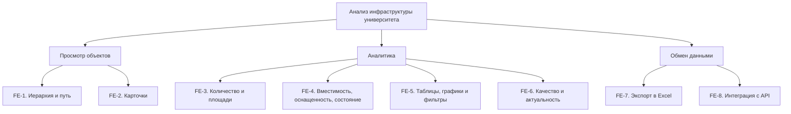

# Документ о концепции и границах кейса

| Поле | Значение |
|------|----------|
| Кейс | _название варианта_ |
| Индустриальный партнер | _организация / подразделение_ |
| Версия | `0.1-draft` |
| Дата | ГГГГ-ММ-ДД |
| Статус | черновик / на ревью / согласовано |
| Авторы | |

> [!NOTE]
> Заполняйте документ на языке заказчика. Образец глубины проработки — [`example/case_concept.md`](../example/case_concept.md). Колонки ID в таблицах шаблона — подсказка структуры, а не обязательная схема нумерации.

## 1. Введение

Руководству и хозяйственным службам университета нужна система, в которой можно перейти от общей структуры инфраструктуры к зданию, этажу и отдельному помещению, посмотреть его характеристики и получить понятные сводные показатели.

Сейчас сведения представлены в JSON, отдельных таблицах и прототипах. Пользователю приходится разбираться в структуре данных и самостоятельно проверять, что означает каждая цифра. Площадь здания, сумма площадей комнат и площадь конкретной категории помещений могут иметь разный смысл. Отсутствующие сведения в некоторых существующих методах API превращаются в нули.

Предлагаемое решение - веб-система для просмотра и анализа инфраструктуры. Она показывает путь до объекта, сведения из источников, доступные агрегаты и качество данных. Первая версия ориентирована на достоверное представление имеющихся сведений. Она не заменяет систему первичного учета и не обещает рассчитать показатели, для которых отсутствуют исходные данные.

## 2. Бизнес-контекст и цели

### 2.1. Исходные данные

Заказчик описывает инфраструктуру университета в виде дерева: организация, группы объектов, здания и сооружения, этажи и помещения. Для собственных зданий, общежитий и клинических баз глубина и состав ветвей различаются. Есть потребность в привычном названии помещения и названии по БТИ, сведениях о подразделении со ссылкой на его страницу, коменданте общежития и характеристиках помещения.

Текущий подход опирается на большой ответ `GET /api/infrastructure`, после которого клиент строит дерево и сводные показатели. В переписке обсуждаются ограниченная загрузка дочерних элементов, пагинация и отдельный метод получения показателей. Эти предложения требуют согласования контракта, а не автоматически становятся утвержденным ТЗ.

Предоставленный `structure.json` содержит 1 967 вхождений узлов, 1 966 различных GUID и глубину 0–7. Все узлы имеют один `TypeID` — «ПодразделенияОрганизаций», поэтому это поле не позволяет отличить здание от комнаты. Один GUID «Спортлагеря» встречается в двух ветках. Площади, типы помещений, места и оборудование заполнены неоднородно; встречаются числовые строки с десятичной запятой и служебное значение `-1`. Число узлов не равно числу физических помещений.

Проблемы текущего процесса: ручное сведение информации; неоднозначная классификация объектов; нулевые метрики при нераспознанном типе; возможное повторное суммирование объекта и его дочерних узлов; смешение обычной площади, площади БТИ и суммы площадей помещений; отсутствие подтвержденных данных об использовании помещений по времени.

### 2.2. Возможности бизнеса

Единый просмотр инфраструктуры позволит хозяйственным службам быстрее находить объект, проверять его характеристики и видеть пробелы учета. Руководство и аналитики смогут получать сопоставимые сводки по выбранной группе объектов, а не каждый раз собирать таблицу вручную.

Отдельное представление площади БТИ и суммы площадей помещений поможет обнаруживать расхождения, если подтверждены состав и происхождение обоих значений. Явные статусы качества позволят отличать нулевую величину от неизвестного значения и направлять уточнения владельцам данных.

В последующих выпусках возможен анализ использования и загрузки помещений. Для него потребуются данные о периоде, доступном времени, занятых местах или посещениях; текущий снимок структуры этих сведений не дает.

### 2.3. Бизнес-цели

#### BO-1. Сократить среднее время поиска сведений о помещении не менее чем на 30% в течение месяца после первого выпуска системы

Точная формулировка бизнес-цели (Planguage):

| Параметр | Значение |
|----------|----------|
| Масштабы | поиск помещения, его пути, названий, подразделения и доступных характеристик сотрудниками хозяйственной службы |
| Способ измерения | сравнение среднего времени выполнения одного контрольного набора заданий до внедрения и после него, с одинаковым составом информации и сопоставимыми условиями |
| Показатели в прошлом | исходное время не измерено; фиксируется до пилота на действующем процессе |
| Планируемые показатели | среднее время не более 50% исходного значения |
| Обязательные показатели | среднее время не более 70% исходного значения; предложенный порог подлежит согласованию |

- **BO-2.** Сократить среднее время подготовки сводки площадей, вместимости и оснащенности по выбранной группе объектов не менее чем на 50% в течение месяца после первого выпуска. Сравниваются одинаковые сводки до внедрения и после него; исходное время измеряется до пилота.
- **BO-3.** Обеспечить объяснимость 100% показателей первого выпуска к технической приемке: у каждого показателя доступны определение, единица, область расчета, источник, статус данных и дата источника либо явное указание, что она неизвестна.

### 2.4. Видение решения

Для руководства и сотрудников ВолгГМУ, которым нужны понятные сведения о зданиях и помещениях, система анализа инфраструктуры — это веб-приложение с иерархической навигацией, карточками объектов, проверяемыми дашбордами и экспортом таблиц. В отличие от просмотра исходного JSON и разрозненных таблиц, она сохраняет контекст выбранного объекта и показывает ограничения каждого расчета.

## 3. Стейкхолдеры

### 3.1. Профили заинтересованных лиц

### 3.1. Профили заинтересованных лиц

Отношение сторон ниже — аналитическая оценка по материалам кейса, а не результат проведенного интервью.

| Заинтересованное лицо | Основная ценность | Отношение | Основные интересы | Ограничения |
|-----------------------|-------------------|-----------|-------------------|-------------|
| Руководство университета | Обоснованные решения по инфраструктуре | Предполагается поддержка при достоверных показателях | Сводки, сравнение объектов, понятные ограничения данных | Не может принимать неизвестные значения за полный учет |
| Административно-хозяйственная служба | Быстрый поиск и проверка объектов | Заинтересована; нужна проверка правил учета | Площади, назначение, оборудование, принадлежность | Неоднородность и неполнота реестра |
| Специалисты эксплуатации и БТИ | Корректное сопоставление площадей | Требуется вовлечение | Происхождение площадей, состав объектов и расхождения | Не подтверждены все значения БТИ и даты измерений |
| Аналитики университета | Воспроизводимые расчеты и Excel | Предполагается высокий интерес | Фильтры, определения метрик, проверка результатов | Для части показателей недостаточно данных |
| Представители подразделений | Корректное отображение закрепленных помещений | Отношение требует уточнения | Названия подразделений, ссылки, характеристики | Нет подтвержденного единого правила связывания |
| ИТ-служба и владелец источника | Устойчивая интеграция и контроль доступа | Нужна совместная проработка | Контракт API, обновление, права и нагрузка | Зависимость от существующей системы и ее доступности |
| Коменданты общежитий | Понятное представление общежитий и мест | Отношение требует уточнения | Карточки, вместимость, контактные сведения | Не все сведения доступны в источнике |
| Команда разработки | Однозначные и проверяемые требования | Заинтересована в согласовании границ | Типы, формулы, сценарии и приемка | Противоречия исходных материалов; ограниченный учебный объем |

### 3.2. Матрица влияния / интереса

| Стейкхолдер | Влияние | Интерес | Стратегия работы |
|-------------|---------|---------|------------------|
| Руководство университета | высокое | высокое | согласовывать цели, границы и критерии успеха |
| Административно-хозяйственная служба | высокое | высокое | совместно проверять дерево, карточки и контрольные расчеты |
| Специалисты эксплуатации и БТИ | высокое | высокое | согласовывать происхождение и область учета площадей |
| Аналитики университета | среднее | высокое | проверять формулы, фильтры и экспорт на контрольном наборе |
| Представители подразделений | среднее | среднее | уточнять принадлежность и проверять карточки |
| ИТ-служба и владелец источника | высокое | высокое | согласовывать API, обновление, безопасность и классификацию |
| Команда разработки | высокое | высокое | фиксировать решения и поддерживать трассировку требований |
| Коменданты общежитий | среднее | среднее | проверять отображение общежитий и значений вместимости |

## 4. Функциональные требования

### 4.1. Основные функции

| ID | Функция |
|----|---------|
| FE-1 | Просмотр иерархии инфраструктуры и полного пути выбранного узла с учетом различной глубины ветвей |
| FE-2 | Просмотр карточки объекта или помещения: названия, тип, подразделение и ссылка, комендант общежития, доступные характеристики. Основное название объекта или помещения отображается всегда. Название по БТИ добавляется только тогда, когда оно заполнено и отличается от основного. Если названия совпадают, отображается только основное название. |
| FE-3 | Расчет количества уникальных объектов и помещений, сумм площадей помещений и отдельное представление площади БТИ |
| FE-4 | Представление вместимости, оснащенности и состояния по согласованным определениям и достаточным данным |
| FE-5 | Просмотр сводных таблиц и графиков, фильтрация по группе объектов, типу и подразделению при наличии подтвержденной связи |
| FE-6 | Отображение статуса, полноты доступных значений, источника и актуальности показателей |
| FE-7 | Экспорт полной отфильтрованной таблицы и параметров расчета в Excel |
| FE-8 | Получение структуры, карточек и показателей через согласованный API с ограниченной выдачей и согласованной версией данных |

### 4.2. Дерево функций

### 4.3. Пользовательские истории / варианты использования

| Основное действующее лицо | Варианты использования |
|---------------------------|------------------------|
| Сотрудник хозяйственной службы | Просмотр помещения; Просмотр показателей; Экспорт сводки |
| Аналитик | Просмотр показателей; Экспорт сводки; Проверка исходной карточки |
| Представитель руководства | Просмотр показателей; Экспорт сводки |
| Представитель подразделения или комендант | Просмотр доступного помещения; Просмотр показателей своей области в пределах прав |

### 4.4. Детальный сценарий (минимум один)

#### UC-1. Просмотр помещения

| Поле | Значение |
|------|----------|
| Идентификатор и название | UC-1. Просмотр помещения |
| Автор | Луконин Владимир Кириллович |
| Дата создания | 09.10.2026 |
| Основное действующее лицо | Сотрудник хозяйственной службы |
| Дополнительные действующие лица | Источник инфраструктуры через API |
| Описание | Пользователь проходит по иерархии, выбирает помещение и получает его путь, названия, принадлежность и характеристики |
| Условие-триггер | Возникла потребность проверить сведения о конкретном помещении |
| Предварительные условия | PRE-1. Пользователь авторизован и имеет право чтения объекта. PRE-2. Доступен согласованный источник или сохраненный снимок, обозначенный как таковой |
| Выходные условия | POST-1. Показана карточка выбранного помещения и полный путь. POST-2. Неизвестные характеристики обозначены явно. POST-3. Исходные записи не изменены |
| Приоритет | Высокий |
| Частота использования | Регулярно в рабочее время; фактическое число пользователей и пик обращений уточняются у заказчика |
| Бизнес-правила | BR-1, BR-2, BR-3, BR-4, BR-5 |

**Нормальное направление**

1. Пользователь открывает раздел инфраструктуры
2. Система показывает организацию и доступные группы объектов.
3. Пользователь выбирает группу собственных зданий.
4. Система загружает дочерние объекты выбранной группы
5. Пользователь выбирает здание, затем этаж и помещение, последовательно раскрывая доступные узлы
6. Система определяет тип выбранного узла по согласованной классификации
7. Система показывает полный путь и карточку: обычное название и название по БТИ, тип, площадь, принадлежность, ссылку на подразделение и доступные характеристики
8. Пользователь просматривает сведения и, при необходимости, открывает страницу подразделения.

**Альтернативные направления**

**1.1. Просмотр помещения общежития или клинической базы.** На шаге 3 пользователь выбирает соответствующую группу. Система отображает фактическую структуру этой ветви, не требует промежуточных уровней собственных зданий и показывает коменданта только для общежития при наличии данных. Далее выполняются шаги 6–9.

**1.2. Список дочерних узлов разбит на страницы.** На шаге 4 система отображает текущую страницу и управление переходом. При выборе следующей страницы запрашиваются только ее элементы. Текущий путь сохраняется.

**Исключения**

- **1.0.E1. Источник недоступен.** Показать ошибку и возможность повторить запрос. Если доступен сохраненный снимок, показать его дату загрузки и статус; время загрузки не выдавать за дату обновления источника.
- **1.0.E2. Тип узла не определен.** Показать доступные сведения и статус «Тип не определен». Не объявлять узел помещением по отсутствию детей и не подставлять нулевые метрики.
- **1.0.E3. Часть полей отсутствует.** Сохранить доступные сведения, для остальных показать «Нет данных». Не заменять неизвестное оборудование ответом «Нет».
- **1.0.E4. Объект удален или недоступен пользователю.** Сообщить, что карточка недоступна, и предложить вернуться к доступному родительскому узлу, не раскрывая закрытые сведения.

**Другая информация**

- Типы «организация», «группа», «здание», «этаж», «помещение» определяются согласованным справочником или явным сопоставлением владельца данных.

- Подразделение, ссылка, комендант, кондиционер, жалюзи, сейф, мультимедиа и средства доступности показываются по имеющимся подтвержденным полям. Связи не выводятся из сходства названий.

**Предположения**

Владелец данных согласует классификацию и значения полей, а пользователь имеет доступ через университетскую учетную запись. Правила доступа к конкретным объектам утверждаются до развертывания.

### 4.5. Сжатые сценарии (по образцу Вигерса)
### UC-5. Экспорт сводки

Спецификация средней детализации: экспорт использует уже определенные правила просмотра и расчета.

| Поле | Значение |
|------|----------|
| Идентификатор и название | UC-5. Экспорт сводки |
| Автор | Луконин Владимир Кириллович; Годенко Алексей Константинович |
| Дата создания | 09.10.2026 |
| Основное действующее лицо | Аналитик |
| Дополнительные действующие лица | Сервис формирования Excel; источник данных |
| Описание | Пользователь получает файл с полной таблицей по текущим фильтрам и пояснениями к показателям |
| Условие-триггер | Пользователь выбирает экспорт отображаемой сводки |
| Предварительные условия | PRE-1. Пользователь авторизован и имеет право экспорта. PRE-2. Выбраны область и фильтры, определена версия данных |
| Выходные условия | POST-1. Сформирован файл Excel со всеми строками результата. POST-2. Сохранены фильтры, определения показателей, статусы и информация о датах |
| Приоритет | Высокий |
| Бизнес-правила | BR-5, BR-8, BR-10, BR-11 |

#### Нормальное направление 5.0

1. Пользователь открывает сводку и задает фильтры.
2. Система показывает таблицу, область расчета и версию данных.
3. Пользователь выбирает «Экспорт в Excel».
4. Система проверяет права и получает полный результат по тем же фильтрам и версии, включая строки за пределами текущей страницы.
5. Система формирует файл: лист данных и лист параметров с областью, фильтрами, единицами, определениями, статусами и датами.
6. Пользователь скачивает файл; числовые значения доступны для дальнейшего анализа.

#### Исключения

- **5.0.E1. Результат пуст.** Сообщить об отсутствии строк; допускается выгрузка пустой таблицы с заголовками и параметрами.
- **5.0.E2. Версия данных изменилась.** Использовать зафиксированный снимок; если он недоступен, предложить обновить сводку и повторить экспорт.
- **5.0.E3. Нет прав или произошла ошибка формирования.** Не отдавать неполный файл как успешный результат; показать понятное сообщение и возможность повторить действие при технической ошибке.

#### Другая информация

**BR-11.** Excel содержит все строки выбранного результата, а не только открытую страницу. Известные величины выгружаются числами с единицами в заголовках; неизвестные — пустым числовым значением и отдельным статусом. Текст источника не интерпретируется как формула. Файл не содержит учетных данных, токенов и внутренних реквизитов доступа.

### UC-9. Просмотр показателей

Сжатая спецификация: основные правила расчета перечислены ниже, без повторения навигации UC-1.

| Поле | Значение |
|------|----------|
| Идентификатор и название | UC-9. Просмотр показателей |
| Автор | Луконин Владимир Кириллович; Годенко Алексей Константинович |
| Дата создания | 09.10.2026 |
| Описание | Пользователь выбирает узел, область и фильтры. Система показывает применимые показатели, таблицы и графики по одной версии данных с определениями, единицами, статусами качества и датами |
| Исключения | Неопределенный тип — доступная карточка без выдуманного профиля; нет данных — явный статус; ошибка источника — сообщение или обозначенный сохраненный снимок; недоступная область — отказ без раскрытия сведений |
| Приоритет | Высокий |
| Бизнес-правила | BR-1, BR-2, BR-5, BR-6, BR-7, BR-8, BR-9, BR-10 |

**Другая информация.** Для организации и группы показываются сводки по уникальным объектам; для здания — помещения и доступные показатели площадей; для этажа — показатели его помещений; для помещения — собственные характеристики. Общежития и клинические базы учитываются отдельными согласованными категориями; их площади не выдаются автоматически за собственную площадь университета.

- **BR-6.** Сумма площадей помещений рассчитывается по уникальным помещениям выбранной области с валидной площадью: `S = Σ area(room)`. Площадь здания и его комнат не суммируется вместе. Общие итоги по разным веткам сначала устраняют повторный учет. Назначения «учебное», «жилое» и другие определяются подтвержденным типом.
- **BR-7.** Количество мест и посадочных мест — разные показатели. Мобильные компьютерные станции учитываются на уровне помещений с последующим суммированием без повторения родительских итогов. Средняя оценка состояния допускается только при согласованной шкале и исключении служебных значений. Процент оснащенности требует известного знаменателя и подтвержденного смысла отсутствующего атрибута.
- **BR-8.** Статусы показателя: «Рассчитано», «Частичные данные», «Нет данных», «Неприменимо». Для частичной суммы показывается охват, например «площадь известна у 8 из 10 классифицированных помещений». Это охват полей доступного реестра, а не доказательство полноты инвентаризации. Если ни одного валидного значения нет, сумма не отображается как 0.
- **BR-9.** Площадь БТИ показывается только при подтвержденном происхождении и составе. Разница `Δ = SБТИ − Sпомещений`; относительная разница `Δ% = Δ / SБТИ × 100%` допустима при положительной площади БТИ и сопоставимой области. При частичной сумме расчет обозначается как частичный и не трактуется как окончательное расхождение. Пример: БТИ 1 000 м² и полная сумма помещений 900 м² дают 100 м² и 10%; неизвестное БТИ исключает такой расчет.
- **BR-10.** Таблица, график, итог и Excel используют одинаковые фильтры, определения и версию данных. Числовые строки вида `5 026,6` нормализуются с учетом пробелов и десятичной запятой; некорректные значения помечаются как неизвестные. Расчеты ведутся без промежуточного округления, площади выводятся с двумя знаками после запятой.

UC-4. Сопоставление площадей

| Поле | Значение |
|------|----------|
| Идентификатор и название | UC-4. Сопоставление площадей |
| Автор | Луконин Владимир Кириллович; Годенко Алексей Константинович |
| Дата создания | 09.10.2026 |
| Описание | Сотрудник хозяйственной службы или аналитик выбирает здание и открывает показатели площади. Система отдельно отображает подтвержденную площадь по БТИ и сумму известных площадей уникальных помещений этого здания. Если оба значения доступны и относятся к сопоставимому составу помещений, система показывает разницу в квадратных метрах. При положительной площади БТИ дополнительно отображается относительная разница в процентах. Пользователь может просмотреть список помещений, включенных в расчет, и сведения о полноте заполнения их площадей. |
| Исключения | Площадь по БТИ отсутствует или ее происхождение не подтверждено: показать «Нет данных» и не рассчитывать расхождение. Площади части помещений отсутствуют: обозначить сумму и сравнение как основанные на частичных данных. Области учета несопоставимы: показать значения отдельно с пояснением, без расчета разницы. Площадь БТИ равна нулю: относительная разница не рассчитывается. |
| Приоритет | Высокий |
| Бизнес-правила | BR-2, BR-6, BR-8, BR-9, BR-10 |

**Другая информация.** Площадь здания из исходного JSON нельзя автоматически считать площадью по БТИ: соответствующее поле и его происхождение должен подтвердить владелец данных. При суммировании площадей помещений исключается повторный учет одного помещения и не добавляются площади родительских узлов. Обнаруженное расхождение само по себе не означает ошибку учета: оно может быть связано с неполными данными или различным составом учитываемых площадей.

## 5. Нефункциональные требования

Численные параметры являются проектными предложениями. Они уточняются после подтверждения инфраструктуры и нагрузки.

| ID | Категория | Требование | Проверка или предлагаемый порог |
|----|-----------|------------|--------------------------------|
| NFR-P1 | Производительность | Навигация и карточка не требуют загрузки всего дерева | 95% запросов списка или карточки — до 2 секунд |
| NFR-P2 | Производительность | Основные агрегаты отображаются без длительного ожидания | 95% запросов метрик — до 3 секунд |
| NFR-P3 | Экспорт | Выгрузка типовой таблицы завершается за приемлемое время | До 30 секунд для выборки до 10 000 строк |
| NFR-A1 | Доступность | Система доступна в согласованные рабочие часы | Предлагается 99% рабочего времени за месяц, кроме согласованных окон обслуживания |
| NFR-R1 | Надежность | Неудачная загрузка не разрушает рабочие данные | Предыдущий успешный срез остается доступен |
| NFR-S1 | Доступ | Данные предоставляются согласно роли | Проверены разрешенные и запрещенные операции для всех ролей |
| NFR-S2 | Защита интеграции | Реквизиты доступа к источникам не попадают в браузер, экспорт и открытые журналы | Отсутствие реквизитов в проверяемых ответах и артефактах |
| NFR-C1 | Совместимость | Источник подключается по согласованному контракту | Приемочные примеры структуры и атрибутов успешно обрабатываются |
| NFR-C2 | Совместимость | Excel-выгрузка открывается без нарушения значений и типов | Проверка в согласованной версии Excel |
| NFR-Q1 | Корректность | Одинаковые данные и методика дают одинаковый результат | Совпадение с контрольным расчетом; допустимое отклонение площади при отображении — до 0,01 м² |
| NFR-U1 | Удобство | Пользователь находит помещение и понимает ограничения показателей | Не менее 90% согласованных задач выполнены без помощи разработчика |
| NFR-U2 | Визуальное оформление | Интерфейс соответствует согласованным компонентам дизайн-системы | Проверка макетов и реализации представителем заказчика |
| NFR-M1 | Сопровождение | Формулы, классификация и служебные значения документированы и версионируются | Методика доступна для всех показателей первого выпуска |

Для проверки NFR-P1–NFR-P3 предлагается профиль до 10 000 записей дерева и 20 одновременно работающих пользователей. Это расчетный профиль испытаний, а не подтвержденная фактическая нагрузка.

Обновление, карточка, метрики и экспорт должны согласованно использовать одну версию данных. Смешение разных срезов в одном результате не допускается.

## 6. Границы кейса

### 6.1. In Scope первого выпуска

В первый выпуск входят:

- получение данных из одного согласованного источника и проверка их структуры;
- навигация по собственным объектам, общежитиям и предоставленным клиническим базам;
- поддержка ветвей с разной глубиной;
- карточки объектов и помещений;
- отображение пути и названий без бессмысленного дублирования;
- подтвержденные связи с подразделениями и сведения о коменданте;
- классификация в объеме, необходимом для согласованных показателей;
- расчеты количества, известных площадей, вместимости и оснащенности;
- раздельное отображение площади БТИ и суммы помещений;
- обозначение отсутствующих, частичных и неприменимых показателей;
- таблицы и обоснованные диаграммы;
- экспорт основных таблиц в Excel;
- разграничение доступа и управляемое обновление данных.

Отсутствие исходных значений допускается как состояние данных. Оно не отменяет требования корректно отобразить это состояние.

### 6.2. Out of Scope первого выпуска

| Исключение | Причина |
|------------|---------|
| Расчет фактической загрузки по всем категориям приложения № 2 | Не представлены необходимые учетные данные |
| Финансовая эффективность, доходность, коммунальные индексы | Требуются отдельные финансовые и эксплуатационные источники |
| Автоматическое восстановление всех отсутствующих площадей | Значения нельзя достоверно получить из имеющейся структуры |
| Редактирование первичных сведений вместо учетных систем | Не согласованы ответственность и обратная синхронизация |
| Рейтинг цифровой зрелости и открытости подразделений | Не подтверждена связь с основной задачей первого выпуска |
| Гендерная статистика по ФИО | Не относится к анализу инфраструктуры |
| Аналитика графиков приема руководителей | Отдельная предметная область |
| Научные рейтинги по названиям проектов | Нет подтвержденной методики и достаточного источника |
| Историческая динамика до начала накопления сопоставимых срезов | Нет необходимого ряда наблюдений |
| Публичный доступ из интернета и нативные мобильные приложения | Не подтверждены как потребность первого выпуска |

### 6.3. Состав выпусков

| Направление | Выпуск 1 | Выпуск 2 | Выпуск 3 |
|-------------|----------|----------|----------|
| Структура и карточки | Полный согласованный объем первого выпуска | Улучшения по итогам пилота | Расширение охвата при необходимости |
| Классификация и качество | Базовые правила, статусы, перечни проблем | Расширение и уточнение классификатора | Дальнейшее развитие регламентов качества |
| Площади и оснащенность | Расчет по доступным данным | Расширение после заполнения источников | Дополнительные показатели по согласованию |
| Загрузка | Отображение причин недоступности | Пилотный расчет по категориям с подключенными данными | Расширение после подтверждения источников |
| Исторические сравнения | Не входят | Накопление срезов и проверка сопоставимости | Сравнение и динамика |
| Экспорт | Excel для основных таблиц | Расширенные отчеты | Интеграции по отдельному решению |
| Финансовая аналитика | Не входит | Отдельное обследование | Возможное включение после согласования |

Содержание выпусков 2 и 3 является направлением развития, а не обязательством по срокам или финансированию.

## 7. Ограничения и допущения

### 7.1. Ограничения

| ID | Формулировка |
|---|---|
| LI-1 | Используются существующие источники университета; достоверность отсутствующих данных нельзя обеспечить только разработкой интерфейса |
| LI-2 | Классификатор JSON и классификатор реестра различаются; до подтверждения сопоставления нельзя гарантировать полный разрез по категориям |
| LI-3 | Первая версия не изменяет первичные данные и не заменяет БТИ, бухгалтерский учет и учет использования помещений |
| LI-4 | Интерфейс должен соответствовать дизайн-системе сайта университета |
| LI-5 | Стек, бюджет, серверные ресурсы и даты программных выпусков не установлены в актуальном кейсе. Значения из «плохого ТЗ» не наследуются |
| LI-6 | Письмо и методические рекомендации используются как источник методики; не предполагается, что каждый показатель уже реализуем на имеющейся выгрузке |

### 7.2. Предположения и зависимости

| ID | Тип | Формулировка / проверка |
|---|---|---|
| AS-1 | Допущение | Источник предоставляет стабильную идентичность объектов или владелец данных утверждает правила ее восстановления; проверить Q-6 |
| AS-2 | Допущение | Для пилота можно выбрать объекты из трех веток с контрольными примерами полных, частичных и отсутствующих данных; согласовать Q-10 |
| AS-3 | Допущение | Основным каналом будет внутренний веб-интерфейс; внешняя публикация не требуется. Подтвердить Q-11 |
| AS-4 | Допущение | Предлагаемые KPI и NFR достижимы на выделенной среде; подтвердить нагрузкой и пилотом |
| DE-1 | Зависимость | Владелец данных предоставляет классификатор, семантику атрибутов и связей, правила дублей |
| DE-2 | Зависимость | Эксплуатационная служба подтверждает происхождение, состав и дату площади БТИ |
| DE-3 | Зависимость | ИТ-служба предоставляет штатный доступ к источникам и среду развертывания |
| DE-4 | Зависимость | Университет утверждает права, разрешенные метаданные, коменданта и область экспорта |
| DE-5 | Зависимость | Заказчик выбирает обязательные показатели приложения № 2 и утверждает формулы; для следующих выпусков поставляет недостающие данные |

### 7.3. Приоритеты проекта

| Область | Ограничение | Движущая сила | Степень свободы |
|---|---|---|---|
| Функции | Навигация, карточка, статусы и Excel должны составлять законченный пилот | Практическая работа с инфраструктурой | Можно отложить дополнительные графики и условные производные метрики |
| Качество | Нельзя выдавать неизвестное за достоверное | Воспроизводимость и понятность | Точность смысла важнее числа показателей на экране |
| Сроки | Даты разработки согласуются после устранения блокеров | Получить проверяемый пилот | Охват объектов сокращается только по согласованию |
| Расходы | Бюджет не предоставлен | Использовать доступный IT-ландшафт | Выбор компонентов после оценки ресурсов |
| Персонал | Состав реальной команды разработки не установлен | Нужны аналитик, разработчики, проверяющий и владельцы данных | Совмещение ролей возможно при сохранении ответственности |

### 7.4. Особенности развертывания

Предлагается развертывание серверного адаптера и веб-интерфейса в согласованной среде университета. Источник, аналитическое представление и интерфейс разделяются. Доступ к внутреннему источнику осуществляется сервером; реквизиты не передаются клиенту. Публикация нового снимка выполняется целиком после проверки. Пользователей обучают навигации, трактовке частичных показателей и экспорту на коротком разборе типовых сценариев.

Язык разработки, СУБД, способ аутентификации и инфраструктура размещения здесь не назначаются: актуальные материалы их не устанавливают. Следующее ТЗ должно зафиксировать эти решения с ИТ-службой. Конкретные названия университетских служб в учебном кейсе необходимо сверить с действующей организационной структурой.

### 7.5. Вопросы для установочной встречи

Вопросы с пометкой «блокирует расчет» должны получить ответы до утверждения расчетной части ТЗ. До ответа интерфейс может показывать данные, но не неподтвержденный показатель.

| ID | Вопрос | Кому | Влияние / решение до ответа |
|---|---|---|---|
| Q-1 | Какая версия методики и какие строки приложения № 2 обязательны именно для этого проекта? Как объясняется расхождение SRC-1 с приложенным PDF? | Руководитель проекта, аналитик | Блокирует утверждение состава метрик; применять только проверенные показатели концепции |
| Q-2 | Какие признаки определяют объект, помещение и его назначение? Как сопоставить типы JSON и реестра, включая устаревшие и неизвестные? | Владелец данных, эксплуатация | Блокирует категорийный расчет; не классифицировать только по отсутствию детей/названию |
| Q-3 | Что означают `-1`, пустое значение, 0 и «Нет» в каждом поле? Значит ли отсутствие атрибута отсутствие оборудования? | Владелец данных | Блокирует среднее и проценты оснащенности; неизвестное отмечать явно |
| Q-4 | Где находится площадь БТИ, какой у нее состав и единица, когда она измерена? Есть ли отдельная БТИ этажей? | Эксплуатация, хозяйственная служба | Блокирует достоверное сопоставление; обычную площадь не подписывать «БТИ» |
| Q-5 | Есть ли достоверные даты источника и изменения узлов? Какова требуемая периодичность обновления и допустимое устаревание? | Владелец источника, руководитель проекта | Не подменять дату обновления временем импорта |
| Q-6 | Почему GUID «Спортлагеря» повторяется? Это один объект в двух представлениях? Как различить идентичность и путь, разрешить конфликты повторов? | Владелец данных, серверная разработка | Блокирует общие итоги; не удваивать объект |
| Q-7 | Какие контракты API уже реализованы и могут быть изменены? Нужен ли обоснованно полный обход дерева одним запросом? | Серверная/интерфейсная разработка | Утвердить профильный метод и загрузку детей перед реализацией |
| Q-8 | Как связываются помещения с подразделениями и их страницами, включая несколько владельцев? Откуда берется комендант? | Хозяйственная служба, владелец оргструктуры | Не угадывать связи по текстовому совпадению |
| Q-9 | Какие решения пользователя должны поддерживать состояние, оснащенность и дополнительные графики? Какова шкала оценок? | Заказчик, аналитик | Блокирует среднее состояния; не включать рейтинги автоматически |
| Q-10 | Кто подтверждает полноту инвентаризации, а не только заполнение поля? Какие объекты и ручные расчеты войдут в контрольный набор? | Хозяйственная служба, аналитик | Блокирует утверждение полноты итогов; суммы подписывать как известные |
| Q-11 | Кто имеет доступ к системе и Excel? Какие поля разрешены, какое рабочее окно, нагрузка, браузеры, серверы, сроки и бюджет? | Руководитель проекта, ИТ-служба | Блокирует запуск; предложенные NFR остаются проектными |
| Q-12 | Каков смысл количества мест и мобильных станций на каждом уровне? Есть ли повторные суммы на родителях? | Владелец данных, аналитик | Блокирует профильные итоги; не смешивать вместимости и уровни |
| Q-13 | Какие данные о времени использования, посещениях и занятых местах доступны по единому периоду? | Аналитик, владельцы учета использования | Определяет возможность следующего выпуска; загрузку пока не рассчитывать |

## 8. Риски

| ID | Риск | Вероятность (0–1) | Ущерб (1–10) | Митигация |
|----|------|-------------------|--------------|-----------|
| RI-1 | | | | |

> [!WARNING]
> Риски, которые могут сорвать приемку выпуска 1, вынесите сюда явно.

## 9. Критерии приемки

| ID | Критерий | Как проверяется | Порог | Срок |
|----|----------|-----------------|-------|------|
| SM-1 | | | | |
| AC-1 | | | | |

Партнер принимает работу, если выполнены все критерии со статусом «обязательный» и закрыты In Scope функции выпуска 1.
