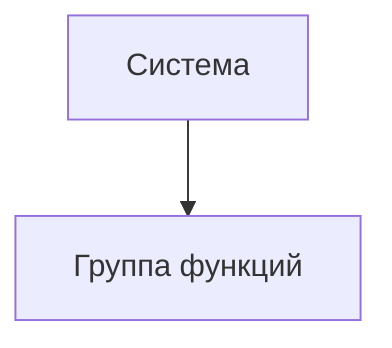

# Документ о концепции и границах кейса

| Поле | Значение |
|------|----------|
| Кейс | _название варианта_ |
| Индустриальный партнер | _организация / подразделение_ |
| Версия | `0.1-draft` |
| Дата | ГГГГ-ММ-ДД |
| Статус | черновик / на ревью / согласовано |
| Авторы | |

> [!NOTE]
> Заполняйте документ на языке заказчика. Образец глубины проработки — [`example/case_concept.md`](../example/case_concept.md). Колонки ID в таблицах шаблона — подсказка структуры, а не обязательная схема нумерации.

## 1. Введение

Руководству и хозяйственным службам университета нужна система, в которой можно перейти от общей структуры инфраструктуры к зданию, этажу и отдельному помещению, посмотреть его характеристики и получить понятные сводные показатели.

Сейчас сведения представлены в JSON, отдельных таблицах и прототипах. Пользователю приходится разбираться в структуре данных и самостоятельно проверять, что означает каждая цифра. Площадь здания, сумма площадей комнат и площадь конкретной категории помещений могут иметь разный смысл. Отсутствующие сведения в некоторых существующих методах API превращаются в нули.

Предлагаемое решение - веб-система для просмотра и анализа инфраструктуры. Она показывает путь до объекта, сведения из источников, доступные агрегаты и качество данных. Первая версия ориентирована на достоверное представление имеющихся сведений. Она не заменяет систему первичного учета и не обещает рассчитать показатели, для которых отсутствуют исходные данные.

## 2. Бизнес-контекст и цели

### 2.1. Исходные данные

Заказчик описывает инфраструктуру университета в виде дерева: организация, группы объектов, здания и сооружения, этажи и помещения. Для собственных зданий, общежитий и клинических баз глубина и состав ветвей различаются. Есть потребность в привычном названии помещения и названии по БТИ, сведениях о подразделении со ссылкой на его страницу, коменданте общежития и характеристиках помещения.

Текущий подход опирается на большой ответ `GET /api/infrastructure`, после которого клиент строит дерево и сводные показатели. В переписке обсуждаются ограниченная загрузка дочерних элементов, пагинация и отдельный метод получения показателей. Эти предложения требуют согласования контракта, а не автоматически становятся утвержденным ТЗ.

Предоставленный `structure.json` содержит 1 967 вхождений узлов, 1 966 различных GUID и глубину 0–7. Все узлы имеют один `TypeID` — «ПодразделенияОрганизаций», поэтому это поле не позволяет отличить здание от комнаты. Один GUID «Спортлагеря» встречается в двух ветках. Площади, типы помещений, места и оборудование заполнены неоднородно; встречаются числовые строки с десятичной запятой и служебное значение `-1`. Число узлов не равно числу физических помещений.

Проблемы текущего процесса: ручное сведение информации; неоднозначная классификация объектов; нулевые метрики при нераспознанном типе; возможное повторное суммирование объекта и его дочерних узлов; смешение обычной площади, площади БТИ и суммы площадей помещений; отсутствие подтвержденных данных об использовании помещений по времени.

### 2.2. Возможности бизнеса

Единый просмотр инфраструктуры позволит хозяйственным службам быстрее находить объект, проверять его характеристики и видеть пробелы учета. Руководство и аналитики смогут получать сопоставимые сводки по выбранной группе объектов, а не каждый раз собирать таблицу вручную.

Отдельное представление площади БТИ и суммы площадей помещений поможет обнаруживать расхождения, если подтверждены состав и происхождение обоих значений. Явные статусы качества позволят отличать нулевую величину от неизвестного значения и направлять уточнения владельцам данных.

В последующих выпусках возможен анализ использования и загрузки помещений. Для него потребуются данные о периоде, доступном времени, занятых местах или посещениях; текущий снимок структуры этих сведений не дает.

### 2.3. Бизнес-цели

#### BO-1. Сократить среднее время поиска сведений о помещении не менее чем на 30% в течение месяца после первого выпуска системы

Точная формулировка бизнес-цели (Planguage):

| Параметр | Значение |
|----------|----------|
| Масштабы | поиск помещения, его пути, названий, подразделения и доступных характеристик сотрудниками хозяйственной службы |
| Способ измерения | сравнение среднего времени выполнения одного контрольного набора заданий до внедрения и после него, с одинаковым составом информации и сопоставимыми условиями |
| Показатели в прошлом | исходное время не измерено; фиксируется до пилота на действующем процессе |
| Планируемые показатели | среднее время не более 50% исходного значения |
| Обязательные показатели | среднее время не более 70% исходного значения; предложенный порог подлежит согласованию |

- **BO-2.** Сократить среднее время подготовки сводки площадей, вместимости и оснащенности по выбранной группе объектов не менее чем на 50% в течение месяца после первого выпуска. Сравниваются одинаковые сводки до внедрения и после него; исходное время измеряется до пилота.
- **BO-3.** Обеспечить объяснимость 100% показателей первого выпуска к технической приемке: у каждого показателя доступны определение, единица, область расчета, источник, статус данных и дата источника либо явное указание, что она неизвестна.

### 2.4. Видение решения

Для руководства и сотрудников ВолгГМУ, которым нужны понятные сведения о зданиях и помещениях, система анализа инфраструктуры — это веб-приложение с иерархической навигацией, карточками объектов, проверяемыми дашбордами и экспортом таблиц. В отличие от просмотра исходного JSON и разрозненных таблиц, она сохраняет контекст выбранного объекта и показывает ограничения каждого расчета.

## 3. Стейкхолдеры

### 3.1. Профили заинтересованных лиц

| Заинтересованное лицо | Основная ценность | Отношение | Основные интересы | Ограничения |
|-----------------------|-------------------|-----------|-------------------|-------------|
| | | | | |

### 3.2. Матрица влияния / интереса

| Стейкхолдер | Влияние (низкое / среднее / высокое) | Интерес (низкий / средний / высокий) | Стратегия работы |
|-------------|--------------------------------------|--------------------------------------|------------------|
| | | | |

## 4. Функциональные требования

### 4.1. Основные функции

| ID | Функция | Краткое описание |
|----|---------|------------------|
| FE-1 | | |
| FE-2 | | |

### 4.2. Дерево функций

### 4.3. Пользовательские истории / варианты использования

| Основное действующее лицо | Варианты использования |
|---------------------------|------------------------|
| | |

### 4.4. Детальный сценарий (минимум один)

#### UC-1. _Название_

| Поле | Значение |
|------|----------|
| Автор / дата | |
| Основное действующее лицо | |
| Дополнительные действующие лица | |
| Описание | |
| Условие-триггер | |
| Предварительные условия | PRE-1. |
| Выходные условия | POST-1. |
| Приоритет | высокий / средний / низкий |
| Частота использования | |
| Бизнес-правила | BR-… |

**Нормальное направление**

1.
2.

**Альтернативные направления**

- 1.1 …

**Исключения**

- 1.0.E1 …

**Другая информация**

-

**Предположения**

-

### 4.5. Сжатые сценарии (по образцу Вигерса)

Остальные UC можно описать короче, если ключевая информация уже есть в другом источнике.

#### UC-n. _Название_

- Описание:
- Исключения:
- Приоритет:
- Бизнес-правила:
- Другая информация:

## 5. Нефункциональные требования

| ID | Категория | Требование | Метрика / порог |
|----|-----------|------------|-----------------|
| NFR-P1 | Производительность | | |
| NFR-A1 | Доступность | | |
| NFR-S1 | Безопасность | | |
| NFR-C1 | Совместимость / IT-ландшафт | | |
| NFR-U1 | Удобство использования | | |

## 6. Границы кейса

### 6.1. In Scope

- …

### 6.2. Out of Scope

- …

### 6.3. Состав первого и последующих выпусков

| Функция | Выпуск 1 | Выпуск 2 | Выпуск 3 |
|---------|----------|----------|----------|
| FE-1 | | | |
| FE-2 | | | |

## 7. Ограничения и допущения

### 7.1. Ограничения и исключения

| ID | Формулировка |
|----|--------------|
| LI-1 | |

### 7.2. Предположения и зависимости

| ID | Тип | Формулировка |
|----|-----|--------------|
| AS-1 | допущение | |
| DE-1 | зависимость | |

### 7.3. Приоритеты проекта

| Область | Ограничения | Движущая сила | Степень свободы |
|---------|-------------|---------------|-----------------|
| Функции | | | |
| Качество | | | |
| Сроки | | | |
| Расходы | | | |
| Персонал | | | |

### 7.4. Особенности развертывания

Стек, инфраструктура, обучение пользователей, необходимые изменения смежных систем.

## 8. Риски

| ID | Риск | Вероятность (0–1) | Ущерб (1–10) | Митигация |
|----|------|-------------------|--------------|-----------|
| RI-1 | | | | |

> [!WARNING]
> Риски, которые могут сорвать приемку выпуска 1, вынесите сюда явно.

## 9. Критерии приемки

| ID | Критерий | Как проверяется | Порог | Срок |
|----|----------|-----------------|-------|------|
| SM-1 | | | | |
| AC-1 | | | | |

Партнер принимает работу, если выполнены все критерии со статусом «обязательный» и закрыты In Scope функции выпуска 1.
